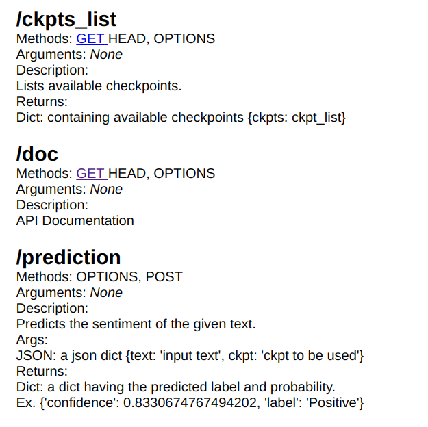

[TOC]

# Sentiment Analysis

A python API to detect sentiment from text using a Bert model trained on data collected from games chat messages.

## Setup

To setup the project you first need to install the requirements:

`pip install -r requirements`

## Dataset

The dataset is collected from 32 different sources (games).

The dataset is split to train, validation, and test datasets.

The validation dataset is composed of samples from the following sources:['GrandTheftAuto(GTA)' 'MaddenNFL' 'johnson&johnson']

The testing dataset is composed of samples from the following sources: ['Cyberpunk2077' 'TomClancysGhostRecon' 'Nvidia']

The rest are used for training.

## Model Training

Note: You can use a pretrained model from [here](https://drive.google.com/file/d/1EqW1jjdMRYPOvty8VF8J14avC-iAYAJ1/view?usp=sharing). Please place the file in `build/models`

To train the model you can run the following command:

`python trainer`.py

You can also use Tensorboard to track the training:

` tensorboard --logdir build/tf_logs/`

## Model Testing

To test the model please run:

`python trainer.py -tr False -c <checkpoint>`

For example `python trainer.py -tr False -c build/models/Bert-epoch=01-val_acc=70.06.ckpt`

This will run the model on both the val and test datasets

## Inference

python infer.py -t "hello this is great" -c build/models/Bert-epoch=01-val_acc=70.06.ckpt

## Running the Inference API

### Running without docker

`python main.py`

### Running within Docker

First, the start.sh should be set to be executable `chmod +x start.sh`

Then the image can be build and a container can be started:

` docker build . -t sentiment-api`

`docker run -p 8080:8080 -dv $PWD:/app sentiment-api`

### API Docs

<h1>
	Documentation
</h1>

